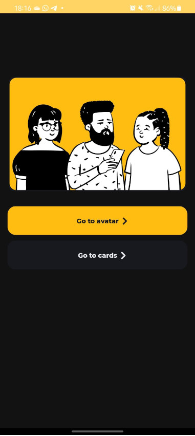
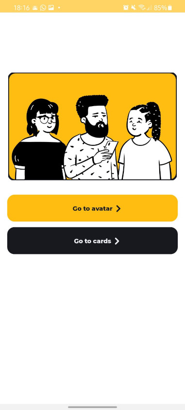
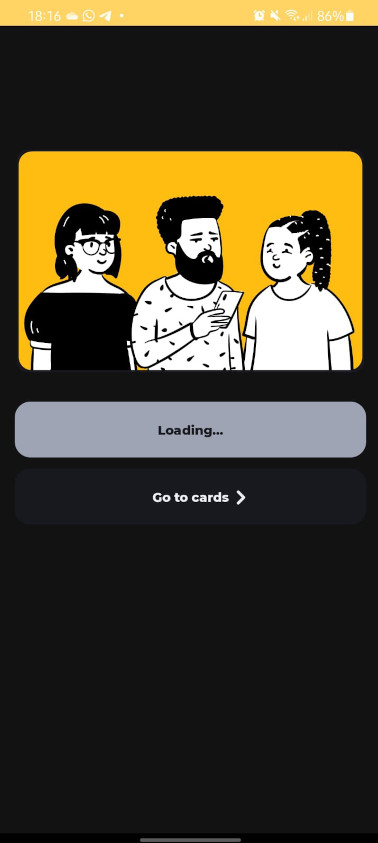
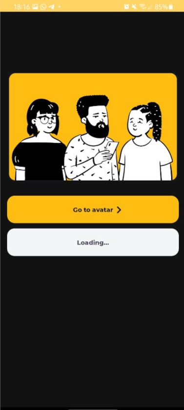
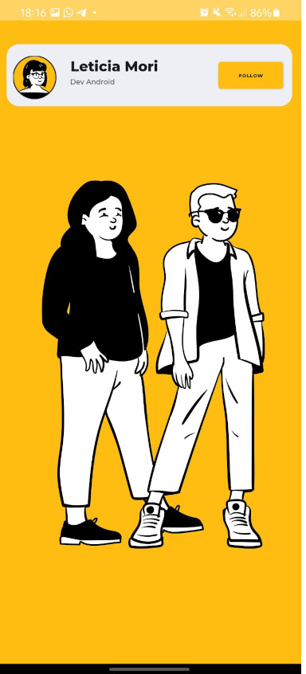

# Lego DS Android

Este projeto é um Sample App onde mostro algumas das minhas competencias tecnicas. Nele há uma série
 de componentes,que juntos formam a tela do aplicativo.

Dentro do App, possue sistema de acessibilidade para pessoas com baixa visão ou cegueira, pessoas 
com daltonismo como por exemplo cores que nao trazem confusão. É de facil usabilidade, esta dentro 
dos padrões documentados e também esta internacionalizado em Ingles, Portugues e Espanhol.

### Telas

